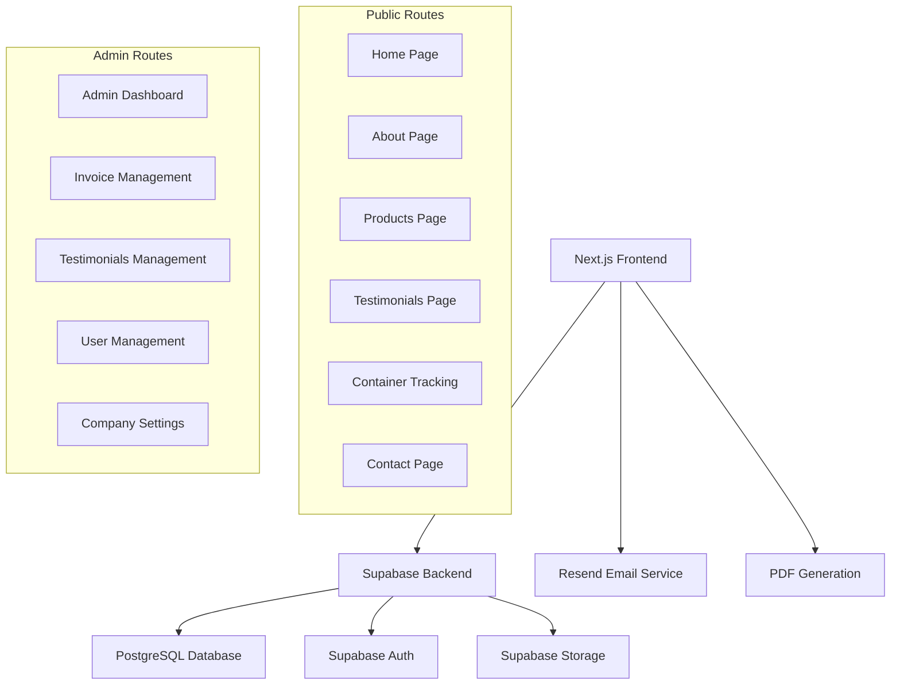

# Design Document

## Overview

The Absad MultiSynergy Limited website will be built as a modern, full-stack Next.js 14 application with a sleek, professional design and fully responsive layout. The architecture leverages Supabase for backend services (authentication, database, file storage) and Resend for email functionality. The design emphasizes beautiful visual aesthetics, seamless user experience, performance, security, and maintainability while providing an elegant interface for both customers and administrators across all device sizes.

## Architecture

### High-Level Architecture



### Technology Stack

- **Frontend Framework**: Next.js 15.4.6 with App Router
- **Styling**: Tailwind CSS 4 with Shadcn/UI components for beautiful, consistent design
- **Design System**: Custom design tokens, animations, and responsive breakpoints
- **Icons**: Lucide React for consistent iconography
- **Animations**: Framer Motion for smooth transitions and micro-interactions
- **Backend**: Supabase (PostgreSQL, Auth, Storage)
- **Email Service**: Resend API
- **PDF Generation**: react-pdf or pdfmake
- **State Management**: React Query (TanStack Query) for server state
- **Authentication**: Supabase Auth with role-based access control
- **File Storage**: Supabase Storage for testimonial videos and invoice PDFs

## Design System and Visual Identity

### Color Palette
- **Primary Colors**: Professional blues and greens reflecting the import/export industry
- **Secondary Colors**: Warm accent colors for call-to-action elements
- **Neutral Colors**: Modern grays for text and backgrounds
- **Status Colors**: Success, warning, and error states with accessible contrast ratios

### Typography
- **Headings**: Modern, bold typography for impact and hierarchy
- **Body Text**: Readable, professional fonts optimized for web
- **Font Sizes**: Responsive typography scale from mobile to desktop
- **Line Heights**: Optimal spacing for readability across devices

### Spacing and Layout
- **Grid System**: 12-column responsive grid with consistent gutters
- **Spacing Scale**: Consistent spacing units (4px, 8px, 16px, 24px, 32px, 48px, 64px)
- **Container Widths**: Maximum widths for different screen sizes
- **Breakpoints**: Mobile-first responsive breakpoints (sm: 640px, md: 768px, lg: 1024px, xl: 1280px)

### Component Design Principles
- **Cards**: Elevated surfaces with subtle shadows and rounded corners
- **Buttons**: Multiple variants (primary, secondary, outline) with hover states
- **Forms**: Clean input designs with floating labels and validation states
- **Navigation**: Intuitive menu structures with clear active states
- **Loading States**: Skeleton loaders and spinners for better perceived performance

### Animations and Interactions
- **Page Transitions**: Smooth fade-ins and slide animations
- **Hover Effects**: Subtle scale and color transitions
- **Form Interactions**: Real-time validation feedback with smooth animations
- **Scroll Animations**: Progressive disclosure of content on scroll

## Components and Interfaces

### Public Website Components

#### Layout Components
- **Header**: Sleek navigation with company logo, responsive mobile menu, and smooth animations
- **Footer**: Beautifully designed footer with contact information, social links, and company details
- **Layout**: Fully responsive wrapper with consistent styling, proper spacing, and mobile-first design

#### Page Components
- **HomePage**: Stunning hero section with gradient backgrounds, company intro with elegant typography, and beautifully showcased featured products
- **AboutPage**: Visually appealing company mission section, team showcase, and warehouse information with professional imagery
- **ProductsPage**: Modern product catalog with high-quality images, hover effects, and detailed descriptions in card layouts
- **TestimonialsPage**: Elegant video testimonial grid with custom playback controls and smooth transitions
- **ContainerTrackingPage**: Clean search interface with modern input design and beautifully formatted results display
- **ContactPage**: Professional contact form with smooth validation feedback and elegant submission handling

#### Shared Components
- **ContactForm**: Reusable form with validation and Resend integration
- **VideoPlayer**: Custom video player for testimonials
- **TrackingCard**: Container status display component
- **LoadingSpinner**: Consistent loading states
- **ErrorBoundary**: Error handling and display

### Admin Dashboard Components

#### Authentication Components
- **LoginForm**: Supabase Auth integration with role validation
- **ProtectedRoute**: HOC for route protection and role checking
- **AuthProvider**: Context provider for authentication state

#### Dashboard Components
- **DashboardLayout**: Admin-specific layout with sidebar navigation
- **MetricsCards**: Dashboard overview with key statistics (invoices and testimonials)
- **DataTable**: Reusable table component for listings
- **Modal**: Reusable modal for forms and confirmations

#### Feature-Specific Components
- **InvoiceForm**: Invoice creation and editing interface
- **InvoiceList**: Invoice management with filtering and actions
- **PDFViewer**: Invoice PDF preview component
- **TestimonialUpload**: Video upload with progress tracking
- **UserManagement**: Admin user creation and role assignment
- **CompanySettings**: Banking details configuration

### API Routes Structure

```
/api/
├── auth/
│   ├── login/
│   └── logout/
├── invoices/
│   ├── create/
│   ├── [id]/
│   ├── pdf/[id]/
│   └── send/[id]/
├── testimonials/
│   ├── upload/
│   └── [id]/delete/
├── tracking/
│   └── search/
├── contact/
│   └── submit/
├── users/
│   ├── create/
│   └── [id]/deactivate/
└── settings/
    └── company/
```

## Data Models

### Database Schema

#### Users Table
```sql
CREATE TABLE users (
    id UUID PRIMARY KEY DEFAULT gen_random_uuid(),
    email VARCHAR(255) UNIQUE NOT NULL,
    password_hash VARCHAR(255) NOT NULL,
    role VARCHAR(20) CHECK (role IN ('ADMIN', 'STAFF')) NOT NULL,
    is_active BOOLEAN DEFAULT true,
    created_at TIMESTAMP WITH TIME ZONE DEFAULT NOW(),
    updated_at TIMESTAMP WITH TIME ZONE DEFAULT NOW()
);
```

#### Testimonials Table
```sql
CREATE TABLE testimonials (
    id UUID PRIMARY KEY DEFAULT gen_random_uuid(),
    video_url TEXT NOT NULL,
    title VARCHAR(255),
    client_name VARCHAR(255),
    uploaded_by UUID REFERENCES users(id),
    is_active BOOLEAN DEFAULT true,
    created_at TIMESTAMP WITH TIME ZONE DEFAULT NOW()
);
```

#### Invoices Table
```sql
CREATE TABLE invoices (
    id UUID PRIMARY KEY DEFAULT gen_random_uuid(),
    invoice_number VARCHAR(50) UNIQUE NOT NULL,
    client_name VARCHAR(255) NOT NULL,
    client_email VARCHAR(255) NOT NULL,
    items JSONB NOT NULL,
    total_amount NUMERIC(10,2) NOT NULL,
    status VARCHAR(20) CHECK (status IN ('PAID', 'UNPAID')) DEFAULT 'UNPAID',
    pdf_url TEXT,
    created_by UUID REFERENCES users(id),
    created_at TIMESTAMP WITH TIME ZONE DEFAULT NOW(),
    updated_at TIMESTAMP WITH TIME ZONE DEFAULT NOW()
);
```

#### Container Tracking Integration
Container tracking data will be fetched from a third-party API service. No local database storage is required for tracking information as it will be retrieved in real-time from the external service.

#### Company Settings Table
```sql
CREATE TABLE company_settings (
    id UUID PRIMARY KEY DEFAULT gen_random_uuid(),
    bank_name VARCHAR(255) NOT NULL,
    account_name VARCHAR(255) NOT NULL,
    account_number VARCHAR(50) NOT NULL,
    swift_code VARCHAR(20),
    currency VARCHAR(10) DEFAULT 'NGN',
    updated_by UUID REFERENCES users(id),
    updated_at TIMESTAMP WITH TIME ZONE DEFAULT NOW()
);
```

#### Contact Inquiries Table
```sql
CREATE TABLE contact_inquiries (
    id UUID PRIMARY KEY DEFAULT gen_random_uuid(),
    name VARCHAR(255) NOT NULL,
    email VARCHAR(255) NOT NULL,
    message TEXT NOT NULL,
    is_responded BOOLEAN DEFAULT false,
    created_at TIMESTAMP WITH TIME ZONE DEFAULT NOW()
);
```

### Data Relationships

- Users can create multiple invoices and testimonials
- Company settings are managed by admin users
- Contact inquiries are standalone records
- Invoice items are stored as JSONB for flexibility
- Container tracking data is fetched from third-party API (no local storage)

## Error Handling

### Client-Side Error Handling

#### Error Boundary Implementation
- Global error boundary for unhandled React errors
- Feature-specific error boundaries for isolated error handling
- Graceful degradation for non-critical features

#### Form Validation
- Client-side validation using React Hook Form with Zod schemas
- Real-time validation feedback
- Server-side validation error display

#### API Error Handling
- Standardized error response format
- User-friendly error messages
- Retry mechanisms for transient failures

### Server-Side Error Handling

#### API Route Error Handling
```javascript
// Standardized error response format
{
  success: false,
  error: {
    code: 'VALIDATION_ERROR',
    message: 'User-friendly error message',
    details: {} // Additional error context
  }
}
```

#### Database Error Handling
- Connection error recovery
- Transaction rollback on failures
- Constraint violation handling

#### External Service Error Handling
- Supabase service error handling
- Resend API error handling with fallback options
- Third-party container tracking API error handling with graceful fallbacks
- File upload error handling with cleanup

## Testing Strategy

### Unit Testing
- Component testing with React Testing Library
- Utility function testing with Jest
- API route testing with Next.js test utilities

### Integration Testing
- Database integration tests with test database
- Supabase integration tests
- Email service integration tests

### End-to-End Testing
- Critical user flows with Playwright or Cypress
- Admin dashboard workflows
- Invoice generation and sending process

### Performance Testing
- Page load performance monitoring
- Database query optimization
- File upload performance testing

## Security Considerations

### Authentication and Authorization
- Supabase Auth with secure session management
- Role-based access control (RBAC)
- Protected API routes with middleware
- JWT token validation

### Data Security
- Input validation and sanitization
- SQL injection prevention through Supabase
- XSS prevention with proper escaping
- CSRF protection with Next.js built-in features

### File Security
- File type validation for uploads
- File size limits
- Secure file storage with Supabase
- Virus scanning for uploaded files (if required)

### API Security
- Rate limiting on API endpoints
- Request validation with Zod schemas
- Secure headers configuration
- HTTPS enforcement

## Performance Optimization

### Frontend Optimization
- Next.js App Router with automatic code splitting
- Image optimization with Next.js Image component
- Lazy loading for non-critical components
- Service worker for caching (if needed)

### Backend Optimization
- Database indexing on frequently queried columns
- Connection pooling with Supabase
- Caching strategies for static data
- Optimized SQL queries

### Asset Optimization
- Tailwind CSS purging for smaller bundle sizes
- Video compression for testimonials
- PDF optimization for faster downloads
- CDN usage through Supabase Storage

## Deployment and Infrastructure

### Deployment Strategy
- Vercel deployment with automatic CI/CD
- Environment-specific configurations
- Database migrations through Supabase CLI
- Monitoring and logging setup

### Environment Configuration
- Development, staging, and production environments
- Environment variables for sensitive data
- Supabase project configuration per environment
- Resend API key management

### Monitoring and Analytics
- Application performance monitoring
- Error tracking and alerting
- User analytics (privacy-compliant)
- Database performance monitoring

## Scalability Considerations

### Database Scalability
- Supabase automatic scaling capabilities
- Query optimization for large datasets
- Archiving strategy for old records
- Read replicas if needed

### Application Scalability
- Stateless application design
- Horizontal scaling through Vercel
- Caching strategies for high-traffic scenarios
- Background job processing for heavy operations

### File Storage Scalability
- Supabase Storage automatic scaling
- CDN integration for global distribution
- File cleanup and archiving policies
- Bandwidth optimization strategies